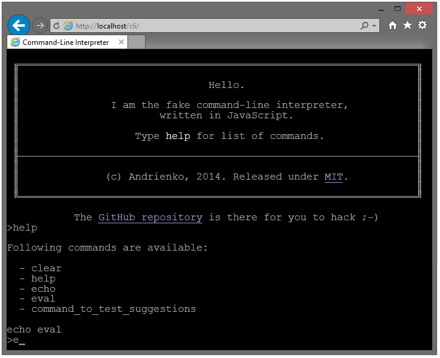

CLI interpreter
===

This one is a fake command-line written in JS.

Yeah, I know, there were a plenty of them, but this one is mine.

Also, the goal of whole thing is to learn how to work with keys. Nothing more.

Usage
---

### init

See the index.html file. To initialize TheCLI the single line of code is required:

    TheCLI.init('cli_instance');

Where cli_instance is an ID of an element that the cli will run in.

### output a line

This will output a line of text into console:

    TheCLI.write('text');

### add own command

    TheCLI.extend('hello',function(data,cli){
        var person = data.parametersText == ''?'world':data.parametersText;
        cli.write('Hello, '+person+'!');
    });

Call the extend TheCLI.extension and pass it two parameters: the name of the command and the callback function
the name of the command should contain no space symbols. Just in case.

The callback function recieves two parameters - the object which contains the data user inputted and the cli object
which contains reference to TheCLI. The second parameter is there for sake of extendability so please use it if you
need to call the cli this function is extending.

The data user inputted has 4 fields:

 - data.text is the full text of what user inputted
 - data.commandText is everything user inputted except the command being called
 - data.command is the command being called
 - data.parameters is an array of every word user inputted, separated by spaces and = sign.

Running multiple instances on same page
---
It was not really meant to be used alongside with something else, but you can add some tiny modifications yourself
in order to make several CLI's work together or to make CLI work with something else keypress-bound. Those changes are:

 - redefining the key-capturing events attached to document.
 - Also modifying the key events of the CLI because those may be pretty obstructive
 - creating several TheCLI object inheritors
 - and modifying (extending) all of the functions for those inheritors
 - also, modifying the css may be required if you want it to be non-fullscreen

So, it may be pretty tough, but actually nothing special.

Plans for future
---

 - colorized output
 - command history
 - blinking cursor
 - cursor character highlighting
 - PgUp/PgDn
 - parameter parsing (add ="value" and --parameter, -parameter, /parameter), non-breaking "not breaked"
 - Unix-like mode (console inside content)
 - make special keys work perfectly
 - copypaste using clippy
 - extended suggests (c will become cl if there are clear and cls)
 - fake file system
 - add allowed keys handeling (F-keys etc)